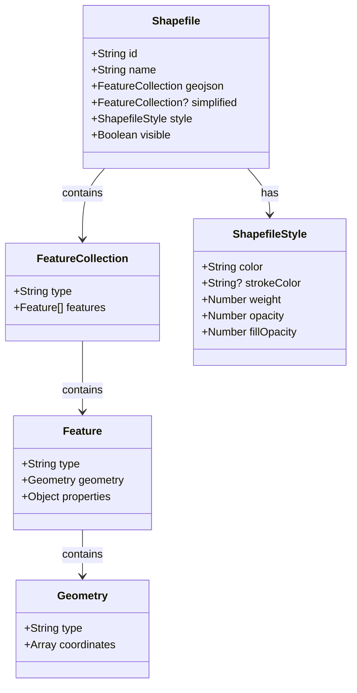
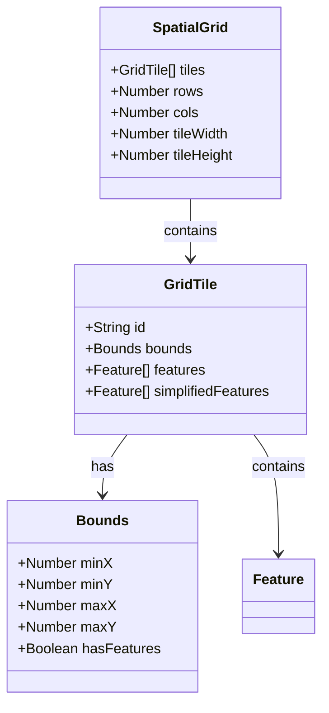
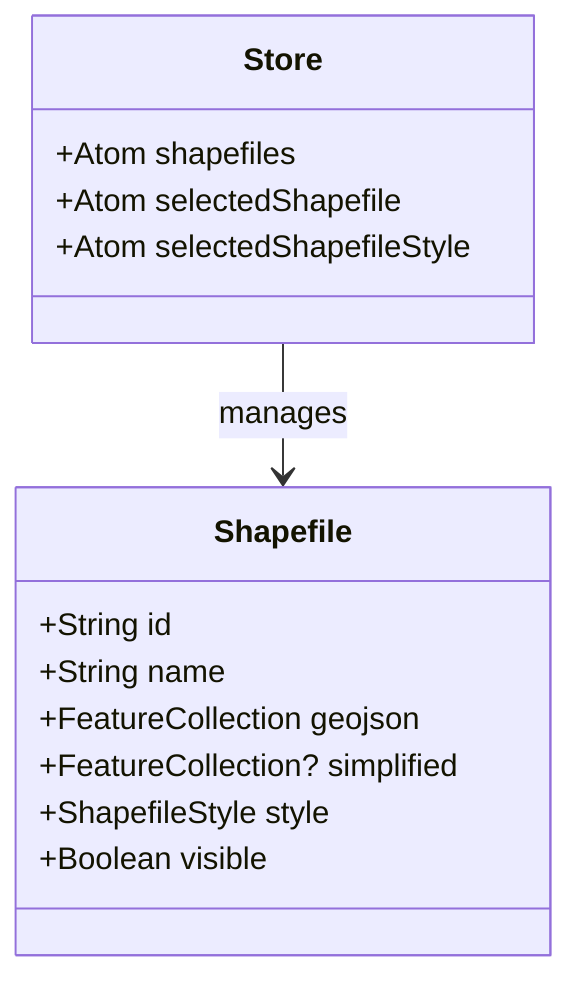
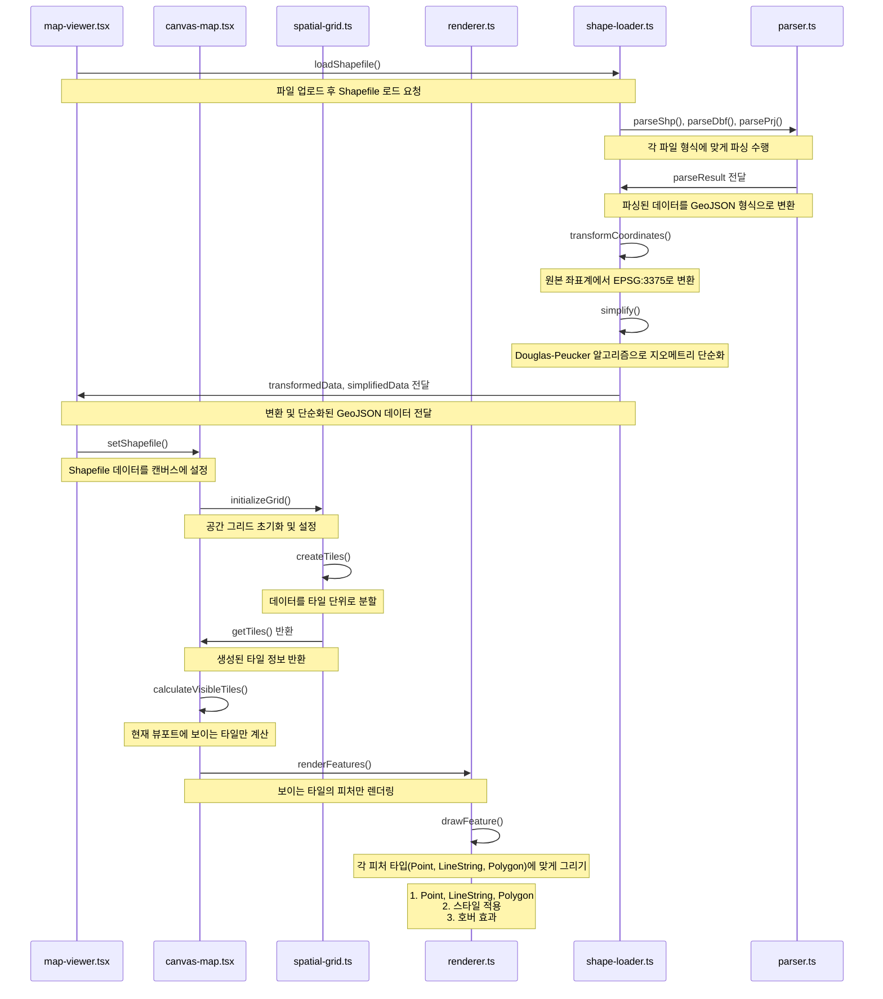

# SHP Viewer

SHP 파일을 웹에서 시각화하고 편집할 수 있는 도구입니다.

## 핵심 자료구조

### Shapefile 구조



### Spatial Grid 구조



### 상태 관리 구조



### 페이지 로드 및 렌더링 프로세스



## 주요 기능

- SHP 파일 업로드 및 시각화
- 레이어별 스타일 커스터마이징
- 레이어 표시/숨김
- 확대/축소 및 이동
- 피처 호버 시 정보 표시
- 좌표계 변환

## 기술 스택

- Next.js 15
- TypeScript
- Tailwind CSS
- Shadcn UI
- Jotai (상태 관리)
- Proj4js (좌표계 변환)
- Web Workers (좌표계 변환 최적화)

## 설치 및 실행

```bash
# 의존성 설치
npm install

# 개발 서버 실행
npm run dev

# 프로덕션 빌드
npm run build

# 프로덕션 서버 실행
npm start
```

## 프로젝트 구조

```
shp-viewer/
├── app/                      # Next.js 앱 디렉토리
│   ├── globals.css           # 전역 스타일
│   ├── layout.tsx            # 레이아웃 컴포넌트
│   └── page.tsx              # 메인 페이지
├── components/               # 리액트 컴포넌트
│   ├── ui/                   # UI 컴포넌트
│   │   ├── button.tsx        # 버튼 컴포넌트
│   │   ├── label.tsx         # 레이블 컴포넌트
│   │   ├── slider.tsx        # 슬라이더 컴포넌트
│   │   ├── tabs.tsx          # 탭 컴포넌트
│   │   ├── toast.tsx         # 토스트 컴포넌트
│   │   ├── toaster.tsx       # 토스터 컴포넌트
│   │   └── use-toast.ts      # 토스트 훅
│   ├── attribute-table.tsx   # 속성 테이블 컴포넌트
│   ├── file-upload.tsx       # 파일 업로드 컴포넌트
│   ├── layer-list.tsx        # 레이어 목록 컴포넌트
│   ├── map-component.tsx     # 지도 컴포넌트
│   ├── map-viewer.tsx        # 지도 뷰어 컴포넌트
│   ├── sidebar.tsx           # 사이드바 컴포넌트
│   └── style-editor.tsx      # 스타일 편집기 컴포넌트
├── lib/                      # 유틸리티 및 상태 관리
│   ├── store.ts              # Zustand 스토어
│   └── utils.ts              # 유틸리티 함수
├── types/                    # 타입 정의
│   └── shpjs.d.ts            # shpjs 타입 정의
├── public/                   # 정적 파일
├── .gitignore                # Git 무시 파일
├── next.config.js            # Next.js 설정
├── package.json              # 패키지 정보
├── postcss.config.js         # PostCSS 설정
├── tailwind.config.js        # Tailwind CSS 설정
└── tsconfig.json             # TypeScript 설정
```

## 시작하기

### 필수 요구사항

- Node.js 22.0.0 이상
- npm 또는 yarn

### 설치 및 실행

```bash
# 저장소 클론
git clone https://github.com/yourusername/shp-viewer.git
cd shp-viewer

# 의존성 설치
npm install
# 또는
yarn install

# 개발 서버 실행
npm run dev
# 또는
yarn dev
```

브라우저에서 `http://localhost:3000`으로 접속하여 애플리케이션을 사용할 수 있습니다.
